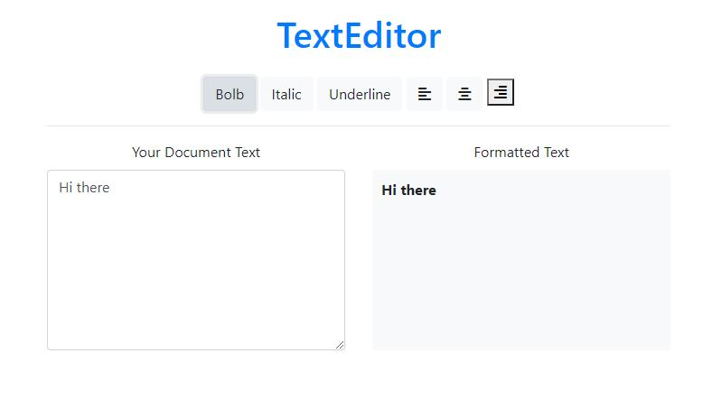

# Text Editor

 *  Update the text in the "Formatted Text" section as a user types in the textarea
 *  Add a .bold, .italic classes to "Formatted Text" when the appropriate button is clicked
 * Add an .underline class to "Formatted Text" when Underline button is clicked
 * Toggle the align style for "Formatted Text" when the appropriate button is clicked

 Mini project from the Profit with Javascript course.
